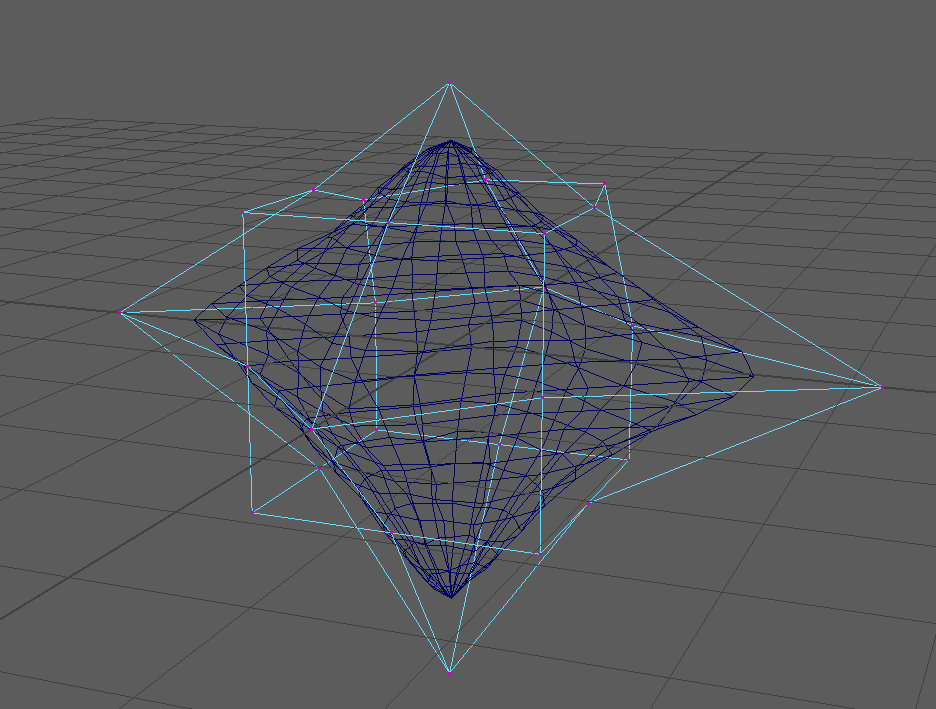

# Stochastic Harmonic Coordinates in Maya

## General

This is a basic implementation of [Stochastic Computation of Barycentric Coordinates](https://graphics.pixar.com/library/StochasticCoordinates/) in a maya C++ plugin. 
It computes harmonic coordinates by walk-on-sphere method.

## Usage 

- Select two mesh objects, the first is the original mesh to be deformed, and the second is the cage mesh. 
- After the two mesh is selected, type the command 'StochasticWarp'.
- Messages will be shown after the binding is complete. 

## Parameter Modifying

[Setting walk-on-sphere iterations](https://github.com/yoharol/StochasticWarp/blob/73e3f292a8aa81fe6516ea9018f21d2586c32b71/src/StochasticWarp.cpp#L73).

## Sourcecode Overview

[core/StWarp/barycentric.cpp](https://github.com/yoharol/StochasticWarp/blob/main/core/StWarp/barycentric.cpp): Computing barycentric coordinates of triangle and quad faces.
[core/StWarp/solver.cpp](https://github.com/yoharol/StochasticWarp/blob/main/core/StWarp/solver.cpp): Walk-on-sphere algorithm for harmonic weights.

## Method Overview

Walk-on-sphere method can be referred to the [monte carol geometry processing](https://www.cs.cmu.edu/~kmcrane/Projects/MonteCarloGeometryProcessing/index.html) paper. 
A minimum c++ example is listed on the project page.

The sampling process can be summarized as:
1. Start from a vertex $\mathbf{u}_i$
2. Compute the closest distance $R$ from $\mathbf{u}_i$ to the cage ([source code](https://github.com/yoharol/StochasticWarp/blob/06f9ef277271109a525877a7cd8151c9e78638ce/core/StWarp/solver.cpp#L140))
3. Create a sphere centralized at vertex $\mathbf{u}_i$  with radius $R$
4. Randomly choose a point  $\mathbf{u}_{i+1}$
5. Repeat from step 1 until  $\mathbf{u}_0$ is close enough to the mesh point

We repeat K points from a single vertex. Then, from a vertex on mesh $\mathbf{x}\\_i$, we can find a sample point $\mathbf{y}\\_{ik}$ in sampling iteration $k\in\{1, 2, \dots, K\}$.

The interpolation weights of any point on cage mesh is already known. Suppose we focus on a cage vertex $\mathbf{v}$, its weights on $\mathbf{y}\\_{ik}$ is $\phi\\_{ik}$. We compute this weights from barycentric coordinates of [triangle face](https://github.com/yoharol/StochasticWarp/blob/06f9ef277271109a525877a7cd8151c9e78638ce/core/StWarp/solver.cpp#L155) and [quad face](https://github.com/yoharol/StochasticWarp/blob/06f9ef277271109a525877a7cd8151c9e78638ce/core/StWarp/solver.cpp#L171). Meanwhile, we convert each point $\mathbf{y}_{ik}$ into homogeneous coordinates

$$\mathbf{g}_{ik} = \begin{pmatrix}\mathbf{y}_{ik} \\ 1\end{pmatrix}$$

Then, we can compute the weights of cage vertex $\mathbf{v}$ on mesh vertex $\mathbf{x}_i$ by

$$\phi_{vi} = \mathbf{x}_i^T \left(\sum_k\mathbf{g}_{ik}\mathbf{g}_{ik}^T\right)^{-1}\left(\sum_k \phi_{ik}\mathbf{g}_{ik}\right)$$

In source code, we summarize $\sum_k\mathbf{g}\\_{ik}\mathbf{g}\\_{ik}^T$ in [M](https://github.com/yoharol/StochasticWarp/blob/06f9ef277271109a525877a7cd8151c9e78638ce/core/StWarp/solver.cpp#L207), and $\sum_k \phi\\_{ik}\mathbf{g}\\_{ik}$ in [m](https://github.com/yoharol/StochasticWarp/blob/06f9ef277271109a525877a7cd8151c9e78638ce/core/StWarp/solver.cpp#L221).

## Benchmark Note

1. In each step of walk-on-sphere, the sampling process of each vertex is totally parallel. 
2. This method is an approximation of a linear kernel, so the convergence comes much faster than common walk-on-sphere algorithm.
